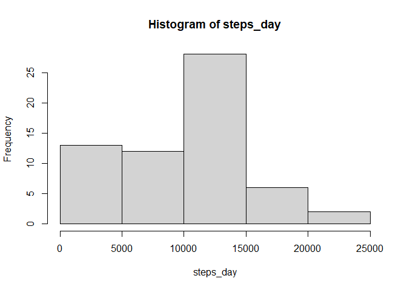
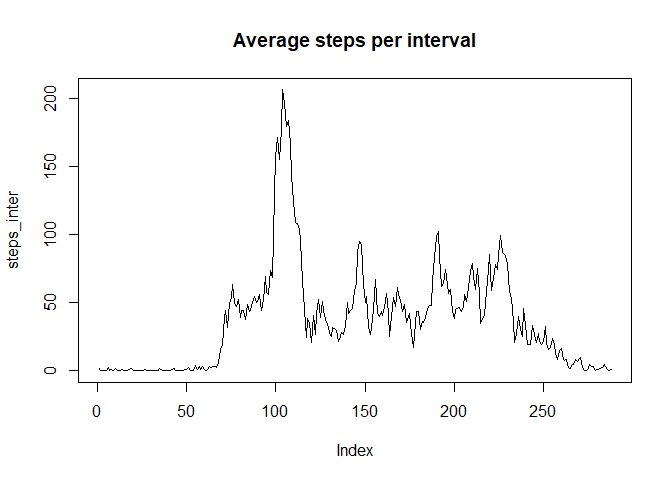
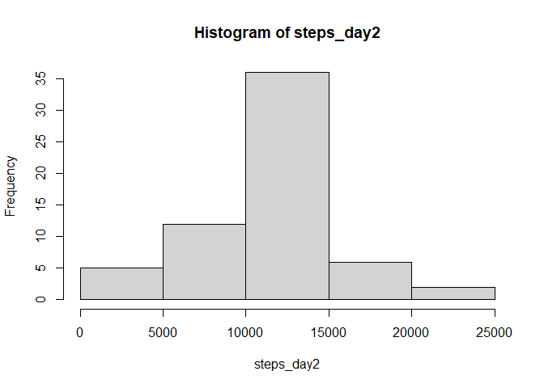
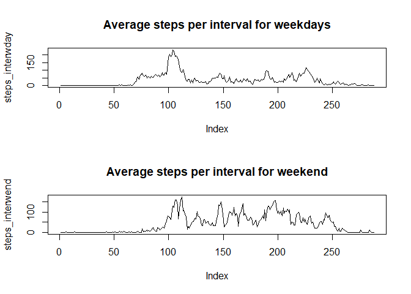

## Loading and preprocessing the data

```r
Activity_data <-read.csv(file="./data/activity.csv",header = TRUE)
```


## What is mean total number of steps taken per day?

1. Creating a variable that contain the total of steps taken per day, <br /> 

```r
steps_day <- tapply(Activity_data$steps, Activity_data$date, FUN = sum,na.rm = TRUE)

head(steps_day)
```

```
## 2012-10-01 2012-10-02 2012-10-03 2012-10-04 2012-10-05 2012-10-06 
##          0        126      11352      12116      13294      15420
```

```r
hist(steps_day)
```

<!-- -->
<br /> 
2. Calculating the mean of the total steps taken per day?<br /> 

```r
mean(steps_day)
```

```
## [1] 9354.23
```

```r
median(steps_day)
```

```
## [1] 10395
```
## What is the average daily activity pattern?

1. Creating a variable that contain the average of steps taken per interval, 

```r
steps_inter <- tapply(Activity_data$steps, Activity_data$interval, FUN = mean,na.rm = TRUE)

head(steps_inter)
```

```
##         0         5        10        15        20        25 
## 1.7169811 0.3396226 0.1320755 0.1509434 0.0754717 2.0943396
```

```r
plot(steps_inter, main = "Average steps per interval", type = "l")
```

<!-- -->

2. Identify which interval on average has the maximum number of steps:

```r
which(steps_inter==max(steps_inter))
```

```
## 835 
## 104
```
## Imputing missing values

1.Calculate and report the total number of missing values in the dataset


```r
sum(is.na(Activity_data))
```

```
## [1] 2304
```

```r
sum(is.na(Activity_data$date))
```

```
## [1] 0
```

```r
sum(is.na(Activity_data$interval))
```

```
## [1] 0
```

2. Devise a strategy for filling in all of the missing values in the dataset. <br />

        Strategy choosen is to replace the"NA" by the average during that interval.
        First we validate that there is only "NA" in col. 'steps'

3. Create a new dataset that is equal to the original dataset but with the missing data filled in.

```r
activity_data2 <- Activity_data
y <- 1
for (i in activity_data2$steps) {
        if (is.na(i)){
          activity_data2[y,1]<- steps_inter[as.character(Activity_data[y,3])]      
        } 
        y <- y+1
     }
```

4.Make a histogram of the total number of steps taken each day and Calculate and report the mean and median total number of steps taken per day. Do these values differ from the estimates from the first part of the assignment? What is the impact of imputing missing data on the estimates of the total daily number of steps?


```r
steps_day2 <- tapply(activity_data2$steps, activity_data2$date, FUN = sum)

head(steps_day2)
```

```
## 2012-10-01 2012-10-02 2012-10-03 2012-10-04 2012-10-05 2012-10-06 
##   10766.19     126.00   11352.00   12116.00   13294.00   15420.00
```

```r
hist(steps_day2)
```

<!-- -->

```r
mean(steps_day2)
```

```
## [1] 10766.19
```

```r
median(steps_day2)
```

```
## [1] 10766.19
```

The median and mean are higher and equal after we have filled the 'NA' value for the average.

## Are there differences in activity patterns between weekdays and weekends?

1. Create a new factor variable in the dataset with two levels – “weekday” and “weekend” indicating whether a given date is a weekday or weekend day.


```r
Activity_data$dayflag <- 0 
y <- 1

for (i in Activity_data$date) {
        if (weekdays(as.Date(i,"%Y-%m-%d")) %in% c("Saturday","Sunday") ){
          Activity_data$dayflag[y] <- "weekend"      
        } else {Activity_data$dayflag[y] <- "weekday"}
        y <- y+1
     }

head(Activity_data)
```

```
##   steps       date interval dayflag
## 1    NA 2012-10-01        0 weekday
## 2    NA 2012-10-01        5 weekday
## 3    NA 2012-10-01       10 weekday
## 4    NA 2012-10-01       15 weekday
## 5    NA 2012-10-01       20 weekday
## 6    NA 2012-10-01       25 weekday
```

2.Make a panel plot containing a time series plot (i.e. \color{red}{\verb|type = "l"|}type = "l") of the 5-minute interval (x-axis) and the average number of steps taken, averaged across all weekday days or weekend days (y-axis). See the README file in the GitHub repository to see an example of what this plot should look like using simulated data.


```r
Activity_wday <- Activity_data[ Activity_data$dayflag == "weekday",]

Activity_wend <- Activity_data[ Activity_data$dayflag == "weekend",]

par(mfrow=c(2,1))

steps_interwday <- tapply(Activity_wday$steps, Activity_wday$interval, FUN = mean,na.rm = TRUE)

plot(steps_interwday, main = "Average steps per interval for weekdays", type = "l")

steps_interwend <- tapply(Activity_wend$steps, Activity_wend$interval, FUN = mean,na.rm = TRUE)

plot(steps_interwend, main = "Average steps per interval for weekend", type = "l")
```

<!-- -->
